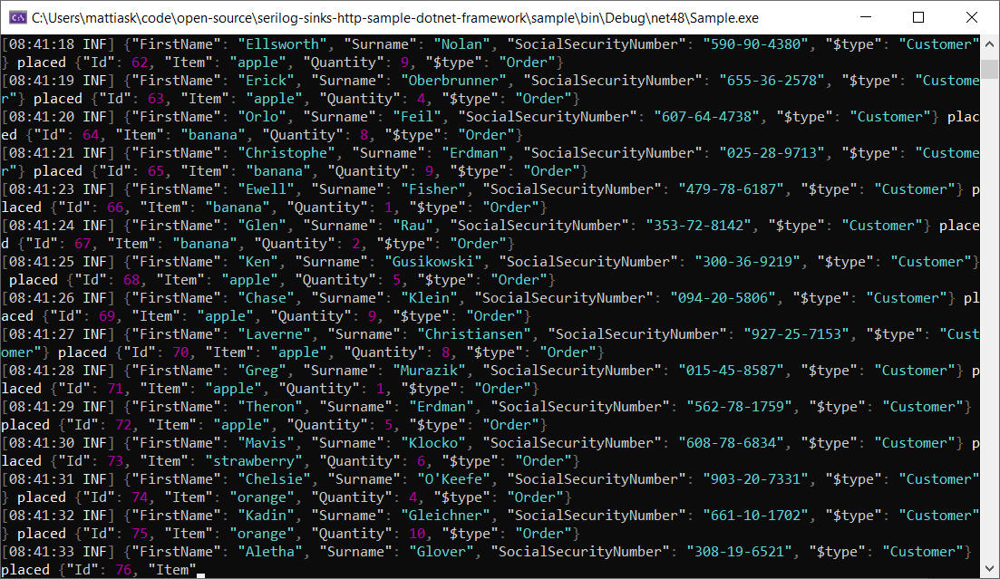
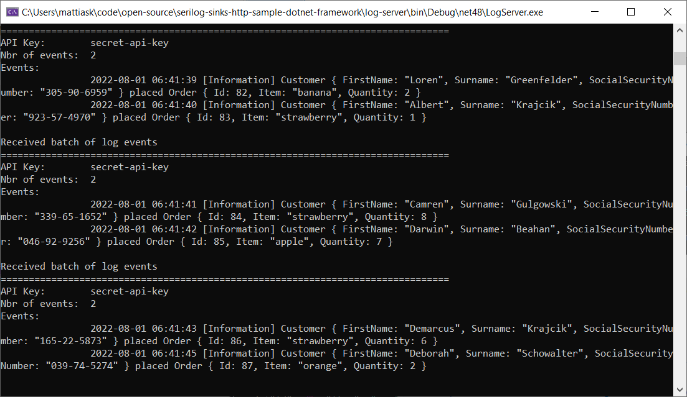

# Serilog.Sinks.Http - Sample in .NET Framework

This repository contains a sample application of [Serilog.Sinks.Http](https://github.com/FantasticFiasco/serilog-sinks-http) producing log events sent over HTTP to a basic log server.

## Running the application

1. Open `dotnet-framework-sample.sln` is Visual Studio
1. Right-click solution is Visual Studio and select _Set StartUp Projects..._
1. Select _Multiple startup projects_ and set action of both _log-server_ and _sample_ to _Start_
1. Click _OK_
1. Press _F5_ to start debugging

What you will end up with is two console applications, one producing log events while the other consumes the log events.

## Remarks

- The sample application is using a custom implementation of a HTTP client, mainly to show that it is possible to do so. But don't specify a custom implementation if you don't have to.
- The sink is configured in code, but could as well be configured in `App.config` using [Serilog.Settings.AppSettings](https://github.com/serilog/serilog-settings-appsettings).